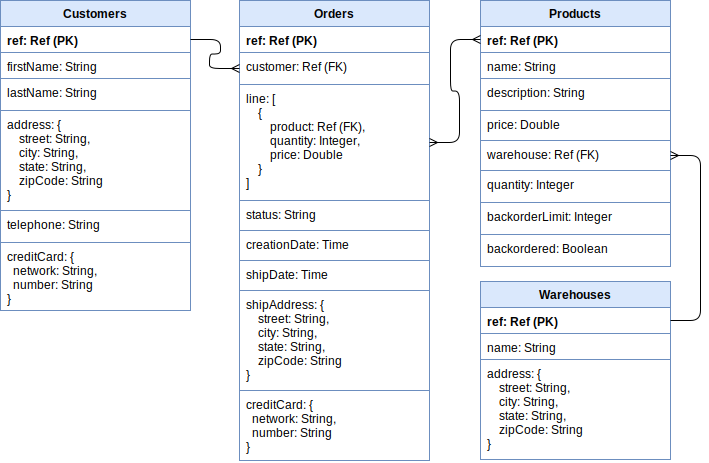

# FaunaDB: Sample DB

#### Table of Contents
* [Schema](#schema)
* [Query Reference](#query-reference)
  * [Warehouse](#warehouse)
  * [Product](#product)
  * [Customer](#customer)
  * [Order](#order)

## Schema

The schema represents the data model for a simple E-Commerce application.

## Query Reference

### Warehouse

<table>
  <tr>
    <th>Operation</th>
    <th>FQL</th>
    <th>GraphQL</th>
  </tr>
  <tr>
    <td valign="top"><b>Create a Warehouse</b></td>
    <td valign="top">
      <pre>
Create(
  Class("warehouses"), { 
    data: { 
      "name": "East", 
      "address": { 
        "street": "13 Pierstorff Drive", 
        "city": "Washington",
        "state": "DC",
        "zipCode": "20220"
      }
    }
  }
);</pre>
    </td>
    <td valign="top">
      <pre>
mutation {
  createWarehouse(data: {
    name: "East"
    address: {
      street: "13 Pierstorff Drive"
      city: "Washington"
      state: "DC"
      zipCode: "20220"
    }
  }){
    _id
  }
}</pre>
    </td>
  </tr>
  <tr>
    <td valign="top"><b>Read a Warehouse</b></td>
    <td valign="top">
      <pre>
Get(Ref(Class("warehouses"), "1549398205020000"));
      </pre>
    </td>
    <td valign="top">
      <pre>
query {
  findWarehouseByID(id: "1549398205020000") {
    _id
    name
    address {
      street
      city
      state
      zipCode
    }
  }
}</pre>
    </td>
  </tr>
  <tr>
    <td valign="top"><b>Update a Warehouse</b></td>
    <td valign="top">
     <pre>
Update(
  Ref(Class("warehouses"), "1549398205020000"), {
    data: {
      "name": "East"
      "address": { 
        "street": "1 Corry Plaza", 
        "city": "Stockton",
        "state": "CA",
        "zipCode": "95205" 
      }
    }
  }
);</pre>
    </td>
    <td valign="top">
      <pre>
mutation {
  updateWarehouse(
    id: "1549398205020000",
    data: {
      name: "East"
      address: {
        street: "1 Corry Plaz"
        city: "Stockton"
        state: "CA"
        zipCode: "95205"
      }
    }
  ){
    _id
  }
}</pre>
    </td>
  </tr>
  <tr>
    <td valign="top"><b>Delete a Warehouse</b></td>
    <td valign="top">
     <pre>
Delete(Ref(Class("warehouses"), "1549398205020000"))
      </pre>
    </td>
    <td valign="top">
      <pre>
mutation {
  deleteWarehouse(id: "235072781994164739") {
    _id
  }
}</pre>
    </td>
  </tr>
  <tr>
    <td valign="top"><b>Read all Warehouses</b></td>
    <td valign="top">
     <pre>
Map(
  Paginate(Match(Index("all_warehouses"))),
  Lambda("nextRef", Get(Var("nextRef")))
);</pre>
    </td>
    <td valign="top">
      <pre>
query {
  allWarehouses {
    data {
      _id
      name
      address {
        street
        city
        state
        zipCode
      }
    }
  }
}</pre>
    </td>
  </tr>
</table>

### Product

<table>
  <tr>
    <th>Operation</th>
    <th>FQL</th>
    <th>GraphQL</th>
  </tr>
  <tr>
    <td valign="top"><b>Create a Product</b></td>
    <td valign="top">
      <pre>
Create(
  Class("products"), {
    data: {
      "name": "Cup",
      "description": "Translucent 9 Oz",
      "price": 6.90,
      "quantity": 100,
      "warehouseId": Ref(Class("Warehouses"), "1549398205020000"),
      "backorderLimit": 10,
      "backordered": false
    }
  }
);</pre>
    </td>
    <td valign="top">
      <pre>
mutation {
  createProduct(data: {
    name: "Cup",
    description: "Translucent 9 Oz",
    price: 6.90,
    quantity: 100,
    warehouse: {
      connect: "1549398205020000" 
    },
    backorderLimit: 10,
    backordered: false
  }){
    _id
  } 
}</pre>
    </td>
  </tr>
  <tr>
    <td valign="top"><b>Read a Product</b></td>
    <td valign="top">
      <pre>
Get(Ref(Class("products"), "220510522473185799"));</pre>
    </td>
    <td valign="top">
      <pre>
query {
  findProductByID(id: "220510522473185799") {
    _id
    name
  	description
  	price
	quantity
	backorderLimit
  	backordered
  }
}</pre>
    </td>
  </tr>
  <tr>
    <td valign="top"><b>Update a Product</b></td>
    <td valign="top">
     <pre>
Update(
  Ref(Class("products"), "220510522473185799"), {
    data: {
      "name": "Cup",
      "description": "Translucent 9 Oz",
      "price": 7.90,
      "quantity": 100,
      "warehouseId": Ref(Class("Warehouses"), "1549398205020000"),
      "backorderLimit": 10,
      "backordered": false
    }
  }
);</pre>
    </td>
    <td valign="top">
      <pre>
mutation {
  updateProduct(
    id: "220510522473185799"
    data: {
      name: "Cup",
      description: "Translucent 9 Oz",
      price: 7.90,
      quantity: 100,
      backorderLimit: 10,
      backordered: false
    }
  ){
    _id
  }
}</pre>
    </td>
  </tr>
<tr>
    <td valign="top"><b>Delete a Product</b></td>
    <td valign="top">
     <pre>
Delete(Ref(Class("products"), "220510522473185799"))
      </pre>
    </td>
    <td valign="top">
      <pre>
mutation {
  deleteProduct(id: "220510522473185799") {
    _id
  }
}</pre>
    </td>
  </tr>
    <tr>
    <td valign="top"><b>Read all Products</b></td>
    <td valign="top">
     <pre>
Map(
  Paginate(Match(Index("all_products"))),
  Lambda("nextRef", Get(Var("nextRef")))
);</pre>
    </td>
    <td valign="top">
      <pre>
query {
  allProducts {
    data {
      _id
      name
      description
      price
      quantity
      backorderLimit
      backordered
    }
  }
}</pre>
    </td>
  </tr>
</table>

### Customer

<table>
  <tr>
    <th>Operation</th>
    <th>FQL</th>
    <th>GraphQL</th>
  </tr>
  <tr>
    <td valign="top"><b>Create a Customer</b></td>
    <td valign="top">
      <pre>
Create(
  Class("customers"), { 
    data: { 
      "firstName": "Auria", 
      "lastName": "Osgardby", 
      "address": { 
        "street": "87856 Mendota Court", 
        "city": "Idaho Falls",
        "state": "ID",
        "zipCode": "83405" 
      }, 
      "telephone": "208-346-0715",
      "creditCard": {
        "network": "Visa",
        "number": "4916112310613672"
      }
    }
  }
);</pre>
    </td>
    <td valign="top">
      <pre>
mutation {
  createCustomer(data: {
    _id
    firstName: "Auria"
  	lastName: "Osgardby"
  	address: {
     street: "87856 Mendota Court"
     city: "Idaho Falls"
     state: "ID"
     zipCode: "83405"
   },
  	telephone: "208-346-0715"
   creditCard: {
     network: "Visa"
     number: "4556781272473393"
    }
  }){
    _id
  }
}</pre>
    </td>
  </tr>
  <tr>
    <td valign="top"><b>Read a Customer</b></td>
    <td valign="top">
      <pre>
Get(Ref(Class("customers"), "1520225686617873"));
      </pre>
    </td>
    <td valign="top">
      <pre>
query {
  findCustomerByID(id: "1520225686617873") {
    firstName
    lastName
    address {
      street
      city
      state
      zipCode
    }
    telephone
    creditCard {
      network
      number
    }
  }
}</pre>
    </td>
  </tr>
  <tr>
    <td valign="top"><b>Update a Customer</b></td>
    <td valign="top">
     <pre>
Update(
  Ref(Class("customers"), "1520225686617873"), {
    data: { 
      "firstName": "Auria", 
      "lastName": "Osgardby", 
      "address": { 
        "street": "87856 Mendota Court", 
        "city": "Idaho Falls",
        "state": "ID",
        "zipCode": "83405" 
      }, 
      "telephone": "719-872-8799",
      "creditCard": {
        "network": "Visa",
        "number": "4916112310613672"
      }
    }
  }
);</pre>
    </td>
    <td valign="top">
      <pre>
mutation {
  updateCustomer(
    id: "1520225686617873"
    data: {
      firstName: "Auria"
      lastName: "Osgardby"
      address: {
        street: "87856 Mendota Court"
        city: "Idaho Falls"
        state: "ID"
        zipCode: "83405"
      },
      telephone: "719-872-8799"
      creditCard: {
        network: "Visa"
        number: "4556781272473393"
      }
    }
  ){
    _id
  }
}</pre>
    </td>
  </tr>
<tr>
    <td valign="top"><b>Delete a Customer</b></td>
    <td valign="top">
     <pre>
Delete(Ref(Class("customers"), "1520225686617873"))</pre>
    </td>
    <td valign="top">
      <pre>
mutation {
  deleteCustomer(id: "1520225686617873") {
    _id
  }
}</pre>
    </td>
  </tr>
    <tr>
    <td valign="top"><b>Read all Customers</b></td>
    <td valign="top">
     <pre>
Map(
  Paginate(Match(Index("all_customers"))),
  Lambda("nextRef", Get(Var("nextRef")))
);</pre>
    </td>
    <td valign="top">
      <pre>
query {
  allCustomers {
    data {
      _id
      firstName
      lastName
      address {
        street
        city
        state
        zipCode
      }
      telephone
      creditCard {
        network
        number
      }
    }
  }
}</pre>
    </td>
  </tr>
</table>

### Order

<table>
  <tr>
    <th>Operation</th>
    <th>FQL</th>
    <th>GraphQL</th>
  </tr>
  <tr>
    <td valign="top"><b>Submit an Order</b></td>
    <td valign="top">
      <pre>
Call(
  Function("submit_order"), 
    "1",
    [
      Object({
        "productId": "1",
        "requestedQuantity": 12
      }),
      Object({
        "productId": "2",
        "requestedQuantity": 22
      }),
      Object({
        "productId": "3",
        "requestedQuantity": 8
      })
    ]
);</pre>
    </td>
    <td valign="top">
      <pre>
//TODO: we need to support GraphQL input type in order to use current function as is.</pre>
    </td>
  </tr>
  <tr>
    <td valign="top"><b>Read an Order</b></td>
    <td valign="top">
      <pre>
Get(Ref(Class("orders"), "235070169871812108"));
      </pre>
    </td>
    <td valign="top">
      <pre>
query {
  findOrderByID(id: "235070169871812108") {
    _id
    customer {
      firstName
    }
    line {
      product {
        _id
        name
      }
      quantity
      price
    }
    status
    creationDate
    shipDate
    shipAddress {
      street
      city
      state
      zipCode
    }
    creditCard {
      network
      number
    }
  }
}</pre>
    </td>
  </tr>
    <tr>
    <td valign="top"><b>Read all Orders</b></td>
    <td valign="top">
     <pre>
Map(
  Paginate(Match(Index("all_orders"))),
  Lambda("nextRef", Get(Var("nextRef")))
);</pre>
    </td>
    <td valign="top">
      <pre>
query {
  allOrders {
    data {
      _id
      customer {
        firstName
      }
      line {
        product {
          _id
          name
        }
        quantity
        price
      }
      status
      creationDate
      shipDate
      shipAddress {
        street
        city
        state
        zipCode
      }
      creditCard {
        network
        number
      }
    }
  }
}</pre>
    </td>
  </tr>
</table>